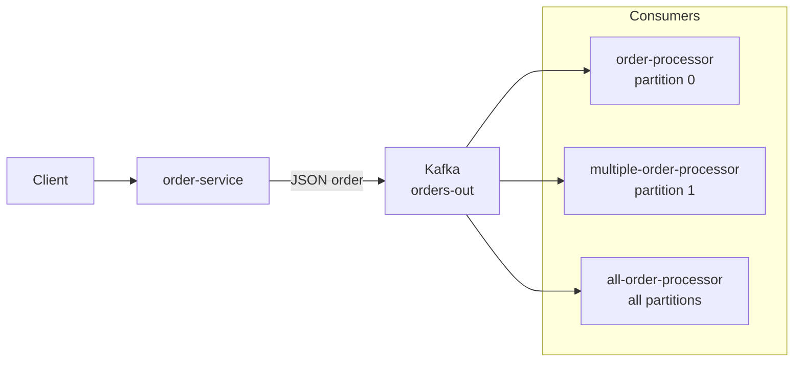

# Vert.x + Kafka — Order Processing Demo

A demonstration of using Eclipse Vert.x with Apache Kafka for an order processing pipeline. The `order-service` module exposes a REST endpoint to submit orders, which are sent to a Kafka topic; multiple consumer verticles process orders from different partitions to illustrate ordered and parallel consumption.

## 🗂️ Modules
| Path                       | Description                           |
|----------------------------|---------------------------------------|
| `order-service`            | REST API → produces to **orders-out** |
| `order-processor`          | Consumes partition 0                  |
| `multiple-order-processor` | Consumes partition 1                  |
| `all-order-processor`      | Consumes all partitions               |

## ✅ Prerequisites
- Java 21  
- Maven 3.9+  
- Running Kafka broker (defaults to `192.168.99.100:9092`)

## ⚡ Quick Start
```bash
# Start Zookeeper (if needed)
docker run -d --name zookeeper -p 2181:2181 zookeeper:3.5

# Start single-node Kafka
docker run -d --name kafka -p 9092:9092 \
  --link zookeeper:zookeeper \
  -e KAFKA_ZOOKEEPER_CONNECT=zookeeper:2181 \
  -e KAFKA_ADVERTISED_LISTENERS=PLAINTEXT://192.168.99.100:9092 \
  -e KAFKA_OFFSETS_TOPIC_REPLICATION_FACTOR=1 \
  confluentinc/cp-kafka:latest

# Build all modules
mvn clean package

# Run verticles
java -jar order-service/target/order-service-*.jar
java -jar order-processor/target/order-processor-*.jar
java -jar multiple-order-processor/target/multiple-order-processor-*.jar
java -jar all-order-processor/target/all-order-processor-*.jar
```

## 🏗️ Architecture


## 🔧 Configuration
| Key                  | Default                | How to override               |
|----------------------|------------------------|-------------------------------|
| `bootstrap.servers`  | `192.168.99.100:9092`  | `env KAFKA_BOOTSTRAP_SERVERS` |
| `topic`              | `orders-out`           | `env KAFKA_TOPIC`             |

## 🔍 Testing
Consume messages from the `orders-out` topic using the Kafka console consumer:
```bash
kafka-console-consumer --bootstrap-server 192.168.99.100:9092 \
  --topic orders-out --from-beginning
```

## 📜 License
MIT © Piotr Mińkowski